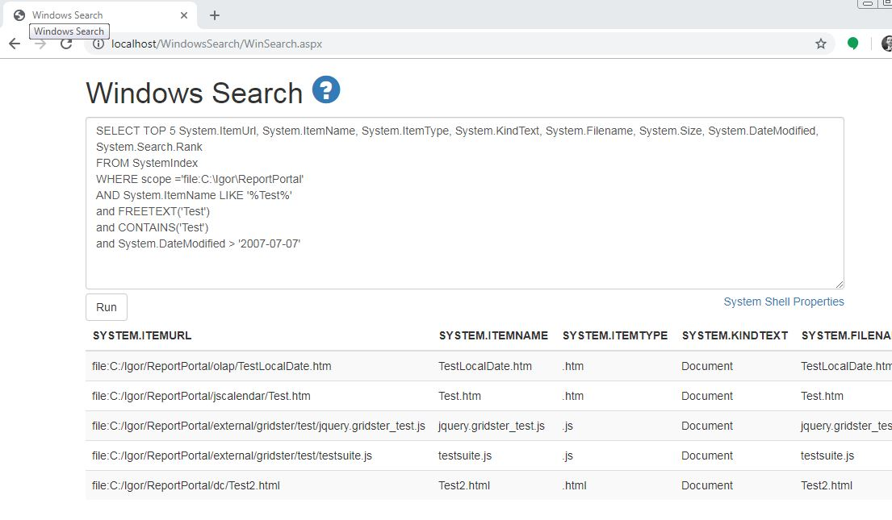

# Windows Search ASP.NET

Originally posted here:
https://www.codeproject.com/Articles/5204134/Windows-Search-ASP-NET

## Introduction
This application shows how to search Windows Index in ASP.NET. Windows Search builds a full-text index of files on a computer. This application lets you search by file contents and file attributes.

## Using the Code
The code uses OleDb Search.CollatorDSO provider to communicate with the Windows Search service on the local or remote computer.

## Windows Search
Windows Search lets you search contents of the files.

1. Make sure that "Windows Search" service is running:
2. Make sure your folder is added under "Indexing Options". Go to: Control Panel > Indexing Options.
3. Check PDF Filter. Install PDF Filter if it is missing from Adobe. Check office files (docx, xlsx, pptx) filters. Install. Microsoft Office 2010 Filter Packs if they are missing.
5. You can test the index by doing content search in Windows Explorer. In the top right corner, type "Content:" followed by file content.
6. If you cannot find the file, you can manually rebuild the index:
7. The Windows Search index is stored in "C:\ProgramData\Microsoft\Search\Data\Applications\Windows\Windows.edb" and can be moved to another location.
